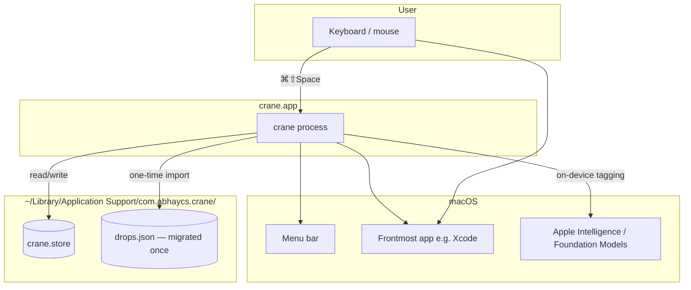
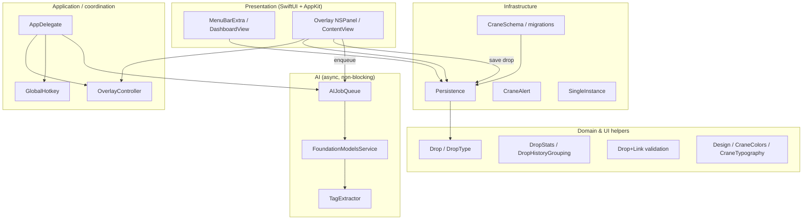
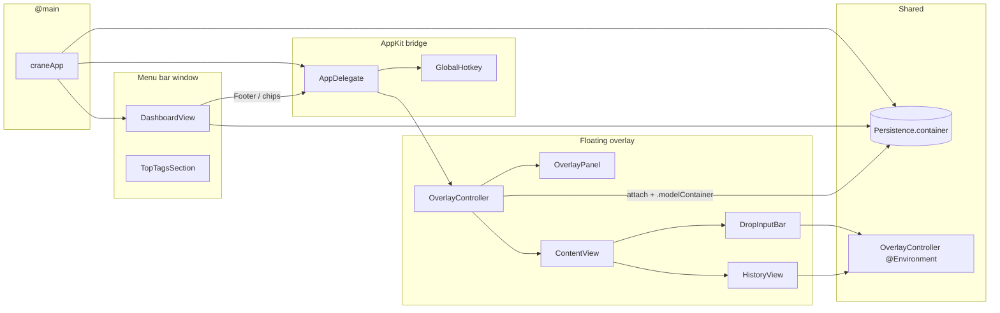
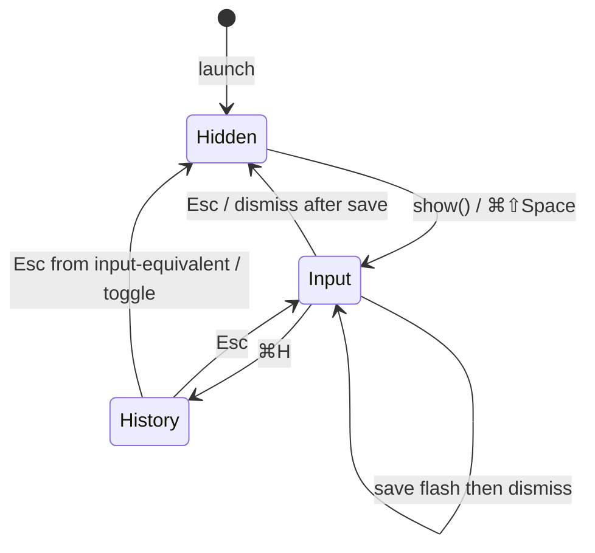
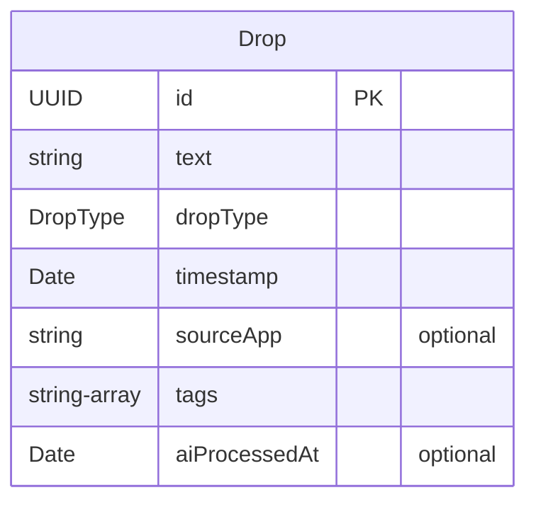
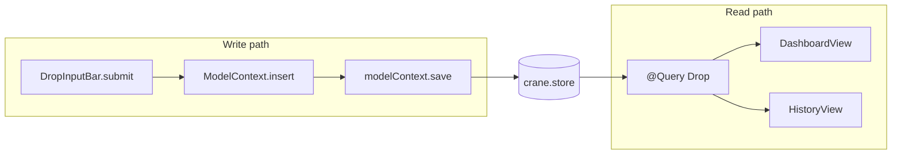
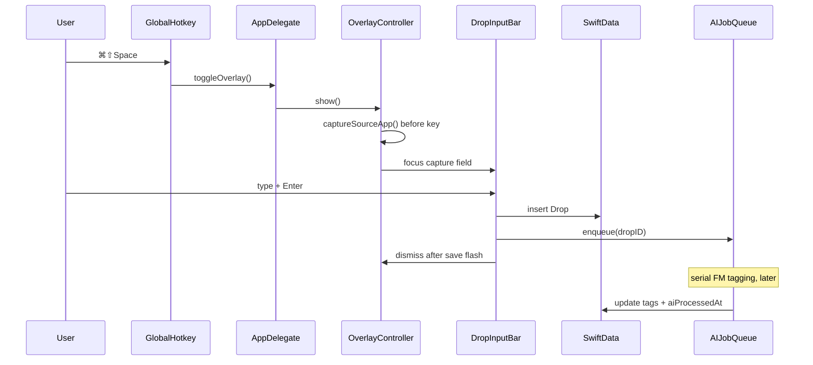
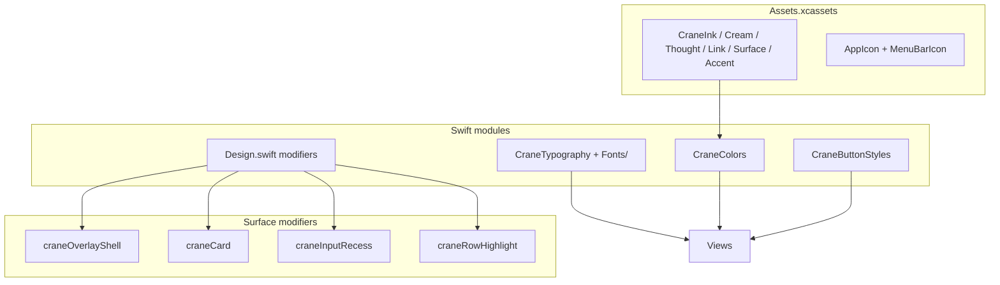

# crane — system architecture

macOS menu-bar capture app: **⌘⇧Space** → type a thought or link → **Enter** → back to work. Drops live in SwiftData; the dashboard and overlay share one store.

---

## 1. System context



| Boundary | Notes |
|----------|--------|
| **Activation** | `.accessory` — no Dock icon, no Cmd-Tab |
| **Sandbox** | App Sandbox; global hotkey via Carbon `RegisterEventHotKey` |
| **Single instance** | `SingleInstance` exits duplicate processes |
| **Persistence** | SwiftData `ModelContainer` at `crane.store` |

---

## 2. Layered architecture



---

## 3. Runtime component graph



**Two UI trees, one database:** `MenuBarExtra` and `NSHostingView<ContentView>` both use `Persistence.container`, so `@Query` updates propagate instantly across surfaces.

---

## 4. Overlay UI state machine



| State | Panel size | SwiftUI root |
|-------|------------|--------------|
| **Input** | 620×116 | `DropInputBar` |
| **History** | 620×480 | `HistoryView` |

`OverlayController.applySize` anchors the **top** of the panel so growth is downward. `inputResetToken` clears the capture field on dismiss.

---

## 5. Data model & persistence





| Module | Role |
|--------|------|
| `Drop.swift` | `@Model` entity |
| `CraneSchema.swift` | `CraneSchemaV1`, `CraneMigrationPlan` |
| `Persistence.swift` | Container factory, JSON migration, recovery / ephemeral fallback |
| `DropStats.swift` | `todayCount`, `streakDays`, `dailyCounts`, `typeBreakdown`, `topTags` |
| `DropHistoryGrouping.swift` | Today / Yesterday / date sections for history |

---

## 6. Capture flow (sequence)



**Link mode:** `Drop+Link` normalizes URLs; invalid input shows `LinkValidationHint` without saving.

**Mirror field:** `CaptureMirrorField` uses a clear `TextField` + visible `Text` overlay (AppKit glyphs unreliable in transparent panel).

---

## 7. AI tagging pipeline

```mermaid
flowchart LR
    subgraph Trigger["Triggers"]
        SAVE[New drop saved]
        BF[Backfill on launch +8s]
    end

    subgraph Queue["AIJobQueue @MainActor"]
        ENQ[pending UUIDs]
        DRAIN[serial drain]
        CD[cooldown on provider crash]
    end

    subgraph Service["FoundationModelsService"]
        AVAIL[tagAvailability]
        FM[SystemLanguageModel contentTagging]
        GEN[@Generable DropTagsResult]
    end

    SAVE --> ENQ
    BF --> ENQ
    ENQ --> DRAIN
    DRAIN --> FM
    FM --> GEN
    GEN -->|tags on Drop| SD[(SwiftData)]
```

| File | Responsibility |
|------|----------------|
| `AIService.swift` | Protocol + `AIAvailability` |
| `FoundationModelsService.swift` | Apple Intelligence adapter |
| `TagExtractor.swift` | Prompt / post-processing |
| `AIJobQueue.swift` | Queue, rate limit, crash cooldown |
| `TopTagsSection.swift` | Dashboard “Top Tags” + skeleton / unavailable UI |

Tagging **never blocks** capture; failures set `aiProcessedAt` with empty tags.

---

## 8. Design system (cross-cutting)



---

## 9. Repository layout

```
crane/                          # Xcode target (Swift app)
├── craneApp.swift              # @main MenuBarExtra
├── AppDelegate.swift           # Hotkey, overlay, lifecycle
├── GlobalHotkey.swift          # Carbon hotkey
├── SingleInstance.swift        # Duplicate guard
├── OverlayController.swift     # Panel logic + state
├── OverlayPanel.swift          # NSPanel subclass
├── ContentView.swift           # Input ↔ history switch + capture pill
├── HistoryView.swift           # Searchable drop list
├── DashboardView.swift         # Menu-bar dashboard
├── Drop.swift / Drop+Link.swift
├── DropRow.swift / DropStats.swift / DropHistoryGrouping.swift
├── Persistence.swift / CraneSchema.swift
├── CraneAlert.swift
├── Design.swift / CraneColors.swift / CraneTypography.swift
├── CraneButtonStyles.swift / CraneSectionHeader.swift
├── EmptyStateView.swift / TagChip.swift / TopTagsSection.swift
├── AI/                         # On-device tagging
├── Assets.xcassets/            # Colors + icons
└── Fonts/                      # Instrument Serif, Geist

landing/                        # Marketing site (static HTML/CSS/JS)
icons/                          # Logo explorations (wingspan = production)
docs/                           # This document
issues.md                       # Prioritized tracker
```

---

## 10. External dependencies

| Framework | Use |
|-----------|-----|
| **SwiftUI** | All UI |
| **SwiftData** | Persistence, `@Query`, `@Model` |
| **AppKit** | `NSPanel`, `NSApplication`, alerts, activation |
| **Charts** | Dashboard activity sparkline |
| **FoundationModels** | Apple Intelligence tagging |
| **Carbon** | `RegisterEventHotKey` |
| **os** | Logging |

---

## 11. Related docs

- [README.md](../README.md) — product overview, keyboard map, design tokens
- [issues.md](../issues.md) — open bugs and QA checklist
