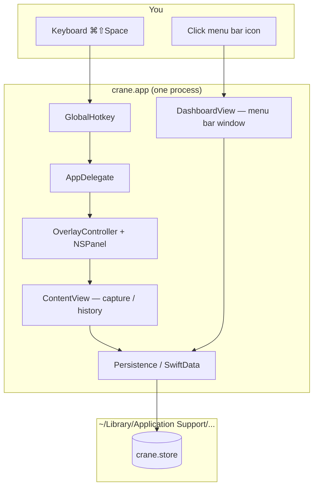
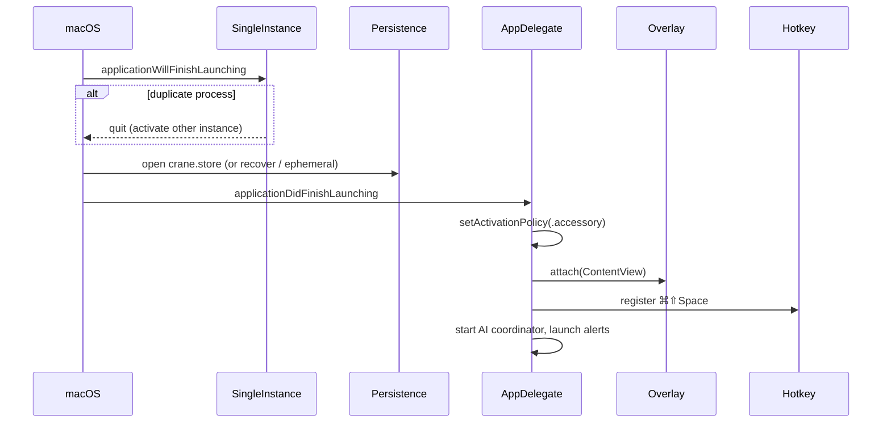
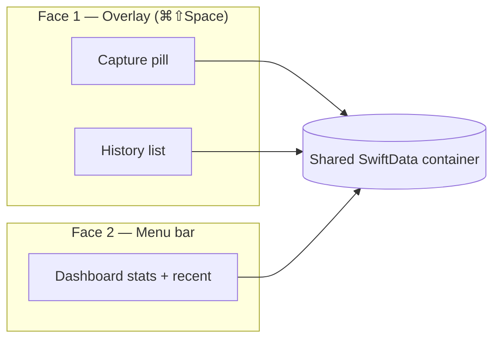
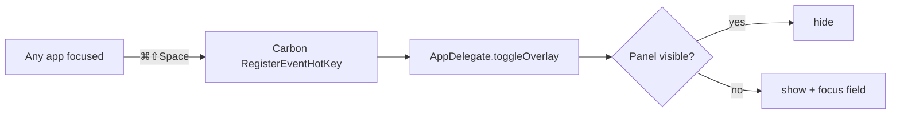
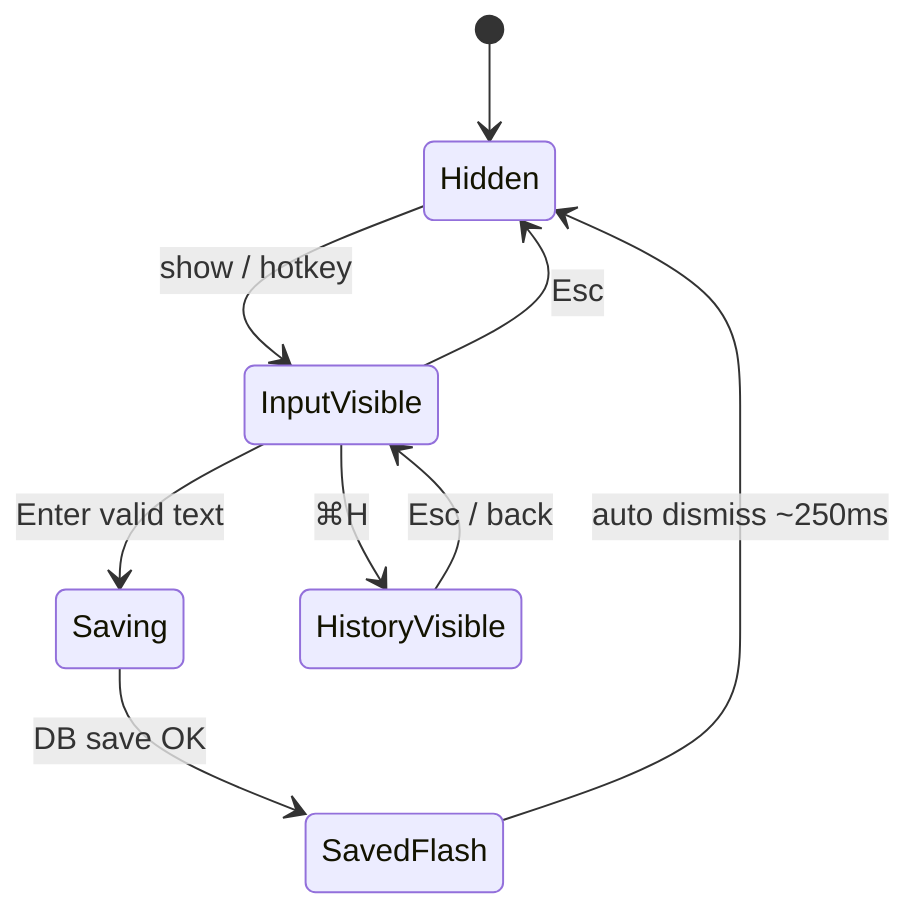
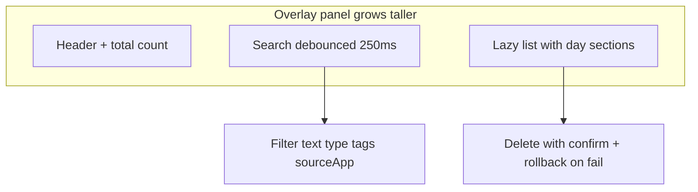
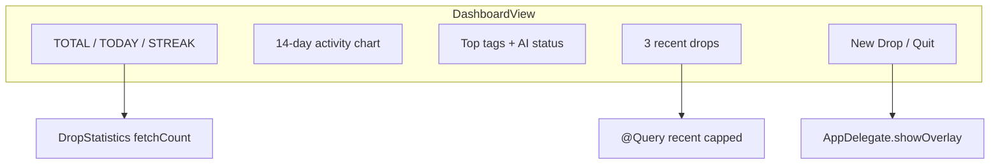
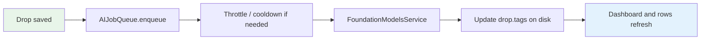
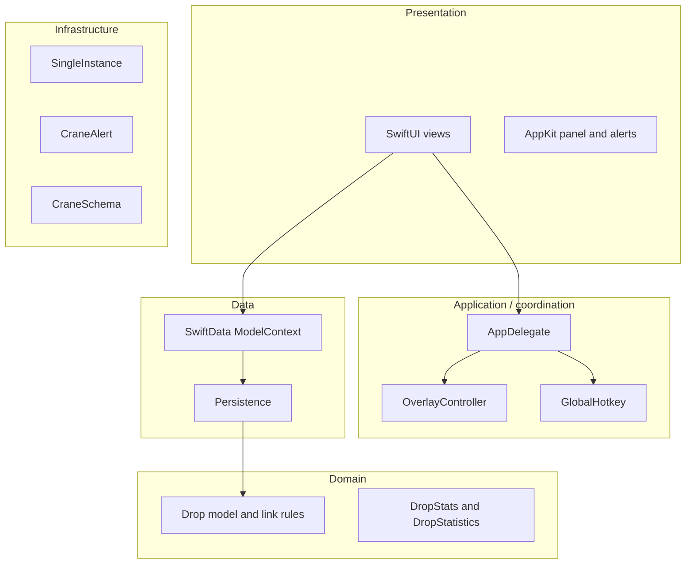
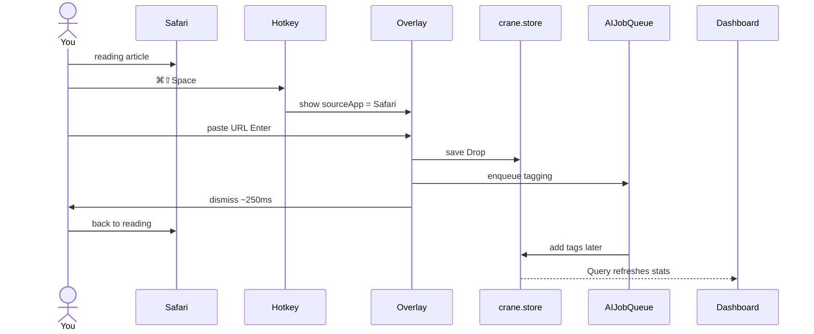

# Understanding crane — a guided tour

**Audience:** CS background, new to Swift / macOS / Xcode.  
**Goal:** Understand what crane does, how the codebase is organized, and *why* each piece exists.

**Related docs:** [ARCHITECTURE.md](./ARCHITECTURE.md) (technical diagrams), [REFACTOR_PLAN.md](./REFACTOR_PLAN.md) (planned cleanup), [issues.md](../issues.md) (bugs & QA).

---

## The problem crane solves

You're deep in Xcode, Figma, or a paper. Your brain interrupts:

> *"Email Maya about Friday."*  
> *"That link Jay sent."*

| Option | Cost |
|--------|------|
| Hold it in memory | Worse focus on the real task |
| Open Notes / Notion | Context switch; thought may vanish |
| Ignore it | Comes back at the wrong time |

**crane's bet:** ⌘⇧Space → one line → Enter → ~2 seconds → back to work. Review later from the menu bar.

This is a **holding pen**, not a full notes app.

---

## Big picture: one process, two UIs, one database



---

## Chapter 1: What is a Mac app (in this project)?

| Idea you know | In crane |
|---------------|----------|
| `main()` | `@main struct craneApp` in `crane/craneApp.swift` |
| Event loop | macOS main run loop; UI on **main thread** |
| UI framework | **SwiftUI** (declarative) + **AppKit** (native Mac windows) |
| Database | **SwiftData** (SQLite under the hood) |
| Build tool | **Xcode** — `crane.xcodeproj` compiles `crane/` → `crane.app` |

### Entry point

```swift
@main
struct craneApp: App {
    @NSApplicationDelegateAdaptor(AppDelegate.self) private var appDelegate

    var body: some Scene {
        MenuBarExtra { DashboardView() } label: { Image("MenuBarIcon") }
            .menuBarExtraStyle(.window)
            .modelContainer(Persistence.container)
    }
}
```

**Why menu bar, not a normal window?**  
crane should stay out of the way: no Dock icon, no extra ⌘Tab slot. The “home base” is the **tray icon**, not a document window.

### AppDelegate — backstage manager

SwiftUI does not cover every Mac need (global hotkeys, custom floating panels, activation policy). `AppDelegate` receives lifecycle events: launch, quit, sleep/wake.

On launch it:

1. Ensures **only one process** runs (`SingleInstance`).
2. Sets **accessory** activation (no Dock / ⌘Tab).
3. Attaches **ContentView** to the floating `OverlayPanel`.
4. Registers **⌘⇧Space** (`GlobalHotkey`).
5. Starts **AI coordinator** and shows launch warnings if needed.

**File:** `crane/AppDelegate.swift`

---

## Chapter 2: Boot sequence (before features)



| Step | File | Problem it solves |
|------|------|-------------------|
| Single instance | `SingleInstance.swift` | Two processes corrupting the same DB |
| Open database | `Persistence.swift` | Drops must survive reboot |
| Accessory app | `AppDelegate.swift` | Hide from Dock / ⌘Tab |
| Build overlay shell | `OverlayController.swift`, `OverlayPanel.swift` | Float over any app, accept keys |
| Register hotkey | `GlobalHotkey.swift` | Capture from anywhere |

---

## Chapter 3: Two faces, one notebook



| UI | Technology | When you use it |
|----|------------|-----------------|
| Floating panel | AppKit `NSPanel` + SwiftUI `ContentView` | Fast capture / search history |
| Menu bar window | SwiftUI `MenuBarExtra` + `DashboardView` | Glance, streak, recent items |

**Why one `Persistence.container`?**  
If capture wrote to DB A and dashboard read DB B, the app would feel broken. Both surfaces share one store; `@Query` in SwiftUI **auto-refreshes** the dashboard when you save from the overlay.

---

## Chapter 4: Feature — global hotkey



| Concern | Implementation |
|---------|----------------|
| Works in sandbox | Carbon hotkey (no special entitlement) |
| Fails at launch | `CraneAlert` — use menu “New Drop” |
| Dies after sleep | Re-register on wake; alert if lost |

**Files:** `GlobalHotkey.swift`, `AppDelegate.swift`

---

## Chapter 5: Feature — capture a thought (core loop)



### What happens on Enter

1. Trim text; enforce max length (`Persistence.maxDropTextLength`).
2. Link mode? Validate and normalize URL (`Drop+Link.swift`).
3. Use `sourceApp` captured **before** crane took keyboard focus.
4. Insert `Drop` → `modelContext.save()`.
5. On failure → remove row, alert user.
6. On success → `AIJobQueue.enqueue` (async; never blocks typing).
7. Checkmark flash → schedule dismiss.

| Guard | Why |
|-------|-----|
| `saving` / `justSaved` | Prevent double-submit |
| `saveDismissGeneration` | Old dismiss timer cannot close a new session |
| `inputResetToken` on hide/show | Clear draft / checkmark state reliably |

**Files:** `ContentView.swift` (`DropInputBar`), `OverlayController.swift`, `Drop.swift`

### Data model: a Drop

```
Drop
├── id: UUID
├── text: String
├── dropType: thought | link
├── timestamp: Date
├── sourceApp: String?      ← e.g. "Safari", "Xcode"
├── tags: [String]          ← filled by AI later
├── aiProcessedAt: Date?    ← tagging finished or skipped
└── aiTaggingFailed: Bool   ← FM error (non-crash)
```

---

## Chapter 6: Feature — link mode

```mermaid
flowchart TD
    T[User pastes text] --> M{Link mode?}
    M -->|no| S[Save as thought]
    M -->|yes| N[normalize URL e.g. add https://]
    N --> V{valid http(s) host?}
    V -->|no| E[Inline error in pill]
    V -->|yes| S2[Save as link]
    S2 --> R[DropRow shows clickable Link]
```

**Why:** Same fast flow as thoughts, but URLs are validated and clickable in history.

**Files:** `Drop+Link.swift`, `DropRow.swift`

---

## Chapter 7: Feature — history



| Behavior | Why |
|----------|-----|
| Esc → pill, Esc again → hide | Do not trap user in history |
| List capped at 5000 + notice | Performance at scale |
| `scrollToken` | Re-scroll when opening same drop from dashboard |

**Files:** `HistoryView.swift`, `DropHistoryGrouping.swift`, `DropRow.swift`

---

## Chapter 8: Feature — menu bar dashboard



| Stat | How computed | Why not only `drops.count` |
|------|----------------|----------------------------|
| TOTAL | `fetchCount` all rows | List UI is capped; total must be exact |
| TODAY / STREAK | Per-day `fetchCount` | Same |
| Chart | 14 daily counts | Habit visualization |

**Files:** `DashboardView.swift`, `DropStatistics.swift`, `TopTagsSection.swift`

---

## Chapter 9: Feature — AI tags (non-blocking)



**Design rule:** The capture path never waits on AI.

| Piece | Role |
|-------|------|
| `AIJobQueue` | Serial queue, rate limit, provider-crash cooldown |
| `FoundationModelsService` | Apple Intelligence adapter |
| `AITaggingCoordinator` | Backfill when AI becomes available |
| `TagExtractor` | Normalize and dedupe tag strings |

**Files:** `crane/AI/*`

---

## Chapter 10: Layer cake (architecture)



If you know **MVC** or layered backends:

- **Views** = SwiftUI screens  
- **Coordinators** = AppDelegate + OverlayController  
- **Domain** = Drop, validation, stats  
- **Data** = Persistence, SwiftData  

No server. **Event-driven** desktop app on the main thread.

---

## Chapter 11: One capture, end to end



---

## File map (where to read code)

| Question | Start here |
|----------|------------|
| What is this app? | `README.md` |
| Technical architecture | `docs/ARCHITECTURE.md` |
| App entry and launch | `craneApp.swift`, `AppDelegate.swift` |
| Capture UI | `ContentView.swift` |
| Floating window | `OverlayController.swift`, `OverlayPanel.swift` |
| Database | `Drop.swift`, `Persistence.swift` |
| Dashboard | `DashboardView.swift`, `DropStatistics.swift` |
| AI pipeline | `crane/AI/AIJobQueue.swift` |
| Design tokens | `Design.swift`, `CraneColors.swift`, `CraneTypography.swift` |
| Bugs and manual QA | `issues.md` |
| Planned refactor | `docs/REFACTOR_PLAN.md` |

---

## Glossary

| Term | Meaning |
|------|---------|
| **AppKit** | Apple's original Mac UI framework (windows, panels, menus) |
| **SwiftUI** | Declarative UI (similar spirit to React on Apple platforms) |
| **SwiftData** | Persistence API: `@Model`, `@Query`, `ModelContext` |
| **MenuBarExtra** | SwiftUI scene type for menu bar icons |
| **NSPanel** | Floating window class used for Spotlight-style overlays |
| **AppDelegate** | Object receiving app lifecycle callbacks on macOS |
| **Drop** | One captured thought or link |
| **Accessory policy** | App runs without appearing in Dock or ⌘Tab |

---

## One-sentence summary

**crane is a menu-bar Mac utility with a global-hotkey floating capture panel, a shared SwiftData store, and a dashboard for review—with AppKit where macOS requires it and on-device AI tagging that never blocks typing.**
