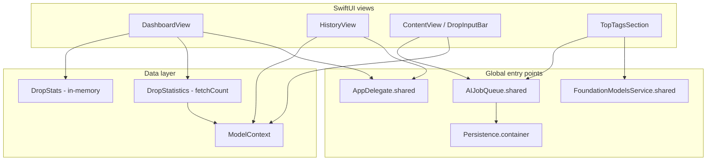

# crane refactor implementation plan

**Goal:** Improve modularity and reuse without changing user-visible behavior (capture flow, hotkeys, persistence, dashboard numbers, overlay layout).

**Scope:** Swift sources under `crane/` (+ `craneTests/`). **Out of scope for v1 refactor:** feature additions, schema changes, visual redesign.

**Status:** Planned — not started. Touch this document when beginning modularization work.

---

## Executive summary

The codebase is small but has grown **two parallel stats systems**, **repeated SwiftData query setup**, and **presentation → `AppDelegate.shared` / singleton** coupling. The highest-value refactors are:

1. Unify analytics behind a single domain layer.
2. Introduce a thin **data access** façade over `ModelContext`.
3. Replace global routing with **environment-injected protocols**.
4. Extract **UI building blocks** from mega-views (`ContentView`, `DashboardView`).

Do this in **phases** with characterization tests after each phase.

---

## Current architecture (as-is)



**Smell:** UI talks to globals and duplicates domain logic in two places (`DropStats` vs `DropStatistics`).

---

## Findings

### 1. Duplicated logic

| Area | Locations | Problem |
|------|-----------|---------|
| **Streak / today / daily / breakdown / top tags** | `DropStats.swift`, `DropStatistics.swift` | Two implementations; streak algorithm differs (Set-of-days vs per-day `fetchCount`). Tests only cover `DropStats`. |
| **Capped `@Query` setup** | `DashboardView.init`, `HistoryView.init` | Identical `FetchDescriptor` + `fetchLimit` boilerplate. |
| **Drop filtering** | `HistoryView.filtered` | Inline predicate logic; not reusable or unit-testable in isolation. |
| **Hidden shortcuts** | `ContentView` (×2), `HistoryView` | Same invisible `Button` + `opacity(0)` + zero frame pattern. |
| **Date labels** | `DropRow.relativeTime`, `DropHistoryGrouping.sectionTitle` | Separate relative vs section formatting; section title allocates `DateFormatter` per call. |
| **Footer / hint key styling** | `DashboardView.FooterButton`, `ContentView.HintKey` | Same mono chip in recess styling. |
| **Delete + animate** | `DashboardView.delete`, `HistoryView.delete` | Same `withAnimation` + `deleteDrop` pattern. |
| **Empty → open overlay** | `DashboardView`, `HistoryView` | Same `AppDelegate.shared?.showOverlay()`. |
| **Scroll-to-drop** | `HistoryView.scrollToFocusedDrop` | Dispatch + animation wrapper could be generic. |

### 2. Poor separation of concerns

| Component | Responsibility today | Issue |
|-----------|---------------------|--------|
| **`ContentView` / `DropInputBar`** | UI + validation + persist + AI enqueue + dismiss timing | Capture is a use-case trapped in a view (~370 lines). |
| **`AppDelegate`** | Lifecycle + hotkey + overlay + AI coordinator + launch alerts | Application shell does too much (acceptable short-term, but blocks testing). |
| **`OverlayController`** | Panel layout, navigation, `sourceApp`, scroll tokens, dismiss generation | “God” coordinator; hard to test layout without AppKit panel. |
| **`DropStatistics`** | DB aggregation + tag sampling | Mixed SQL-style counts and in-memory tag reduction via `DropStats.topTags`. |
| **`TopTagsSection`** | UI + FM availability + queue state | Reads two singletons directly. |
| **`Persistence`** | Container factory + migration + recovery + path helpers | Infrastructure + migration script in one enum. |

### 3. Tight coupling

| Coupling | Call sites | Risk |
|----------|------------|------|
| `AppDelegate.shared` | `DashboardView`, `HistoryView`, `EmptyStateView` (via actions) | Views untestable without AppKit delegate; hidden dependency. |
| `Persistence.container` | `craneApp`, `OverlayController.attach`, `AIJobQueue` | AI layer bypasses SwiftUI’s `modelContext`; two context access styles. |
| `FoundationModelsService.shared` | `TopTagsSection`, `AITaggingCoordinator`, `AIJobQueue` | Hard to mock tagging for UI tests. |
| `CraneAlert.runModal()` | Save/delete/launch/lock/hotkey | Business paths blocked on modal UI; can’t swap for inline errors in tests. |
| **Double container install** | `craneApp.modelContainer` + `OverlayController.attach(.modelContainer)` | Redundant wiring; easy to diverge later. |

---

## Target module structure

```
crane/
├── App/
│   ├── AppDelegate.swift
│   ├── craneApp.swift
│   └── AppServices.swift          # composes hotkey, overlay, AI coordinator
├── Domain/
│   ├── Drop.swift
│   ├── Drop+Link.swift
│   ├── DropFilter.swift           # search matching
│   ├── DropAnalytics.swift        # pure streak/daily/tag math
│   └── CaptureDropCommand.swift   # validate + build Drop + save
├── Data/
│   ├── Persistence.swift
│   ├── DropRepository.swift       # all FetchDescriptor / fetchCount
│   ├── CraneSchema.swift
│   └── ModelContext+DropDeletion.swift
├── Features/
│   ├── Capture/                   # split from ContentView
│   ├── History/
│   ├── Dashboard/
│   └── Overlay/
│       ├── OverlayController.swift
│       └── OverlayPanel.swift
├── AI/                            # unchanged surface, inject dependencies
├── Design/                        # Design, Colors, Typography, shared components
│   ├── Components/
│   │   ├── HiddenShortcutButton.swift
│   │   ├── FlowLayout.swift
│   │   ├── FooterShortcutButton.swift
│   │   └── CraneDateFormatting.swift
│   └── ...
└── Platform/
    ├── GlobalHotkey.swift
    ├── SingleInstance.swift
    ├── CraneAlert.swift           # later: UserNotifier protocol
    └── OverlayRouting.swift       # protocol + AppDelegate conformance
```

**Principle:** Views → use cases / repositories → `ModelContext`. Singletons only at composition root (`AppDelegate` / `craneApp`).

---

## Phase 0 — Safety net (no behavior change)

**Duration:** ~0.5 day  
**Deliverable:** Tests lock current behavior before moves.

| Task | Action |
|------|--------|
| 0.1 | Add Xcode **Unit Test** target; wire `craneTests/` (already on disk). |
| 0.2 | Add `DropStatisticsTests` with in-memory `ModelContainer`: total, today, streak, 14-day chart for known fixtures. |
| 0.3 | Add `DropFilterTests` once `DropFilter` exists (or snapshot `HistoryView.filtered` logic via extracted function). |
| 0.4 | Add `CaptureDropCommandTests`: link/thought validation, max length, normalized text. |
| 0.5 | Document **manual QA checklist** run after each phase (`issues.md` sign-off items). |

**Exit criteria:** `xcodebuild test` green locally; same UI smoke test (⌘⇧Space, save, history, delete).

---

## Phase 1 — Domain extraction (pure Swift, no UI)

### 1.1 Unify analytics

**Problem:** `DropStats` vs `DropStatistics` duplicate concepts.

**Plan:**

1. Add `crane/Domain/DropAnalytics.swift` with **pure functions**:
   - `streakDays(activeDays: Set<Date>, calendar:) -> Int`
   - `hasDropToday(activeDays:, calendar:) -> Bool`
   - `dailyCounts(lastDays:from: [Date], calendar:) -> [(Date, Int)]`
   - `typeBreakdown(drops: [Drop]) -> (thoughts, links)`
   - `topTags(from: [Drop], limit:) -> [(String, Int)]` (move from `DropStats`)

2. Refactor `DropStats.swift` to thin wrappers calling `DropAnalytics` (keep public API for tests).

3. Refactor `DropStatistics.compute` to:
   - Use `DropRepository` (Phase 2) for counts.
   - Build `activeDays` or per-day counts, then call same `DropAnalytics.streakDays`.

**Files touched:** `DropStats.swift`, `DropStatistics.swift`, new `DropAnalytics.swift`, `DropStatsTests.swift`, new `DropAnalyticsTests.swift`.

**Behavior invariant:** Dashboard TOTAL/TODAY/STREAK/chart match pre-refactor on fixtures with >5k drops (use in-memory DB tests).

### 1.2 Extract drop search filter

**New:** `DropFilter.swift`

```swift
struct DropFilter {
    let query: String
    func matches(_ drop: Drop) -> Bool
}
```

Move logic from `HistoryView.filtered` (text, type, tags, `sourceApp`).

**Behavior invariant:** Same search results for fixed `drops` + query strings.

### 1.3 Extract date formatting

**New:** `CraneDateFormatting.swift`

- `static func relativeString(since: Date, now: Date) -> String` (from `DropRow`)
- `static func historySectionTitle(for: Date, calendar:) -> String` (from `DropHistoryGrouping`)
- Shared static `DateFormatter` instances (medium date, etc.)

**Files touched:** `DropRow.swift`, `DropHistoryGrouping.swift`.

**Behavior invariant:** String outputs unchanged for fixed dates/time zones (use `Calendar` + fixed `TimeZone` in tests).

---

## Phase 2 — Data access layer

### 2.1 `DropRepository`

**New:** `crane/Data/DropRepository.swift`

```swift
@MainActor
struct DropRepository {
    let context: ModelContext

    func fetchRecent(limit: Int) throws -> [Drop]
    func totalCount() throws -> Int
    func count(onDay: Date) throws -> Int
    func countToday() throws -> Int
    func count(thoughts:) / count(links:) throws -> Int
    func fetchNewestTaggedSample(limit:) throws -> [Drop]
    func fetchUntagged(limit:) throws -> [Drop]
    func fetch(byID:) throws -> Drop?
    // ...
}
```

Centralize all `FetchDescriptor` construction currently in:

- `DashboardView` / `HistoryView` inits (expose `static func recentDropsQuery(limit:) -> FetchDescriptor<Drop>`)
- `DropStatistics`
- `AIJobQueue`
- `Persistence.fetchAllDropIDs`

**Behavior invariant:** Same fetch limits (5000), sort order, predicates.

### 2.2 Capture use case

**New:** `crane/Domain/CaptureDropCommand.swift` (or `CaptureDropService`)

```swift
struct CaptureDropCommand {
    enum Result { case saved(Drop); case validationError(String); case persistenceError(Error) }

    func run(
        text: String,
        linkMode: Bool,
        sourceApp: String?,
        context: ModelContext,
        maxLength: Int
    ) -> Result
}
```

Move from `DropInputBar.submit()`:

- Trim, length check, link validation/normalization
- Insert + save + rollback on failure
- Return drop ID for AI enqueue (caller still enqueues)

**`ContentView`** only: UI state (`justSaved`, flash), call command, `AIJobQueue.enqueue`.

**Behavior invariant:** Same saves, errors, link normalization; AI still enqueued only on success.

### 2.3 Split `Persistence` concerns

| Keep in `Persistence` | Move to |
|----------------------|---------|
| `container`, `makeContainer`, recovery | `Persistence.swift` |
| `migrateLegacyJSONIfNeeded`, `fetchAllDropIDs` | `LegacyJSONMigrator.swift` |
| `applicationSupportDirectory`, constants | `AppPaths.swift` or keep |

**Behavior invariant:** Ephemeral path, JSON rename rules, archive paths unchanged.

---

## Phase 3 — Decouple UI from globals

### 3.1 Overlay routing protocol

**New:**

```swift
@MainActor
protocol OverlayRouting: AnyObject {
    func showCapture()
    func showHistory(focusing: UUID?, search: String?)
}
```

- `AppDelegate: OverlayRouting` (forwards to `overlay`)
- Environment key: `\.overlayRouting`

Replace every `AppDelegate.shared?.showOverlay()` with `overlayRouting?.showCapture()`.

**Files:** `DashboardView`, `HistoryView`, `EmptyStateView` call sites.

**Behavior invariant:** Footer “New Drop”, empty states, recent tap still open overlay identically.

### 3.2 Composition root / `AppServices`

**New:** `AppServices.swift` (or extend `AppDelegate`)

- Owns `OverlayController`, `GlobalHotkey`, `AIJobQueue`, `AITaggingCoordinator`
- Exposes `makeDropRepository(context:)` for injection in previews

**`craneApp`:** Install environment:

```swift
.environment(\.overlayRouting, appDelegate)
```

**Remove** duplicate `.modelContainer(Persistence.container)` from `OverlayController.attach` if scene already provides container (verify overlay `modelContext` still works — **test carefully**).

**Behavior invariant:** Dashboard and overlay see same store; live updates after capture.

### 3.3 AI dependencies

**New:** `TaggingStatusProviding` protocol (`tagAvailability`, optional `isQueueActive`).

- `FoundationModelsService` + `AIJobQueue` adapter
- Inject into `TopTagsSection` via environment or init parameter
- `AIJobQueue` takes `ModelContext` or `DropRepository` in init instead of `Persistence.container`

**Behavior invariant:** Tagging UI, backfill, cooldown unchanged.

---

## Phase 4 — UI modularization

### 4.1 Split `ContentView.swift`

| New file | Contents |
|----------|----------|
| `Capture/DropInputBar.swift` | Input bar + submit wiring |
| `Capture/CaptureMirrorField.swift` | Mirror field |
| `Capture/CaptureModeSegment.swift` | Thought/Link toggle |
| `Capture/HintChips.swift` | Hint row |
| `ContentView.swift` | Shell + view switch only |

**Behavior invariant:** Layout 620×116, animations, Esc/⌘L/⌘H shortcuts.

### 4.2 Split `DashboardView.swift`

Move private types to `Dashboard/`:

- `StatCard.swift`
- `ActivityChart.swift`
- `TypeBreakdownBar.swift` + `LegendChip.swift`
- `DashboardFooter.swift` (FooterButton)

Use shared `FooterShortcutButton` from Design (merge with `HintKey`).

**Behavior invariant:** 380×520 window, stat cards, chart, recent 3 rows.

### 4.3 Shared UI components

| Component | Replaces |
|-----------|----------|
| `HiddenShortcutButton` | 4× invisible shortcut blocks |
| `FlowLayout` | `TopTagsSection` private layout → `Design/Components/FlowLayout.swift` |
| `AnimatedDropDeletion` modifier | `withAnimation { deleteDrop }` duplication |

### 4.4 Thin `OverlayController`

Extract (optional, Phase 4b):

- `OverlayLayout` — `clampFrame`, `positionOnActiveScreen`, sizes
- `OverlaySessionState` — `scrollToDropID`, `scrollToken`, `inputResetToken`, `saveDismissGeneration`

Keep public API on `OverlayController` as façade.

**Behavior invariant:** Panel position, Esc behavior, post-save dismiss generation.

---

## Phase 5 — Alerts & platform abstractions (optional polish)

| Task | Detail |
|------|--------|
| 5.1 | `UserNotifier` protocol wrapping `CraneAlert` + future inline errors |
| 5.2 | `ModelContext.deleteDrop` calls notifier instead of `CraneAlert` directly |
| 5.3 | Keeps `runModal` for launch until P2-19 inline work ships |

**Behavior invariant:** Same modal copy and timing.

---

## Implementation order & effort

| Phase | Effort | Risk | User-visible risk |
|-------|--------|------|-------------------|
| 0 Tests | S | Low | None |
| 1 Domain | M | Low | None if tests pass |
| 2 Data | M | Medium | Store/query regressions |
| 3 Decouple | M | Medium | Overlay not opening |
| 4 UI split | L | Low | None if mechanical |
| 5 Alerts | S | Low | None |

**Recommended sequence:** 0 → 1 → 2 → 3 → 4 → 5. Do **not** start with file moves (Phase 4) before repository + tests (0–2).

---

## Per-phase verification checklist

After **every** phase:

- [ ] ⌘⇧Space toggle; capture thought + link; invalid link inline error
- [ ] Save → dashboard recent + stats update
- [ ] History search (text, tag, `sourceApp`)
- [ ] Delete with confirm; cancel restore on simulated save failure
- [ ] Sleep/wake hotkey (if hardware available)
- [ ] Second instance exits; lock file behavior
- [ ] FM tagging queue doesn’t block capture
- [ ] `xcodebuild test` + `build` Release

After Phase 1 specifically:

- [ ] Compare `DropStatistics.compute` vs old commit on a DB with 100+ drops

After Phase 3 specifically:

- [ ] Menu-bar “New Drop” and empty-state buttons without `AppDelegate.shared` in views

---

## What we are **not** refactoring (document as accepted)

| Item | Reason |
|------|--------|
| macOS 26.4-only APIs | Product constraint |
| `CraneAlert` modals for save (P2-19) | Separate UX task |
| Full history pagination | Product scope; cap notice is enough for v1 |
| Replacing `@Observable OverlayController` with TCA/etc. | Over-engineering for app size |
| Landing site | Out of app target |

---

## Success metrics

1. **Zero** `AppDelegate.shared` references in `Features/` views.
2. **Single** streak/daily/tag algorithm path (`DropAnalytics`).
3. **One** place that builds `FetchDescriptor<Drop>` (`DropRepository`).
4. `ContentView.swift` under ~80 lines; capture logic in testable command.
5. Unit test coverage for analytics, filter, capture command, repository counts.
6. No changes to `issues.md` manual QA failures.

---

## Suggested PR slices

| PR | Contents |
|----|----------|
| **PR 1** | Phase 0 + Phase 1.1 + 1.2 + 1.3 |
| **PR 2** | Phase 2 (`DropRepository` + `CaptureDropCommand`) |
| **PR 3** | Phase 3 (`OverlayRouting` + AI injection) |
| **PR 4** | Phase 4 UI file splits |
| **PR 5** | Phase 5 (optional) |

---

## Related docs

- [ARCHITECTURE.md](./ARCHITECTURE.md) — current system design
- [../issues.md](../issues.md) — bug tracker and manual QA checklist
